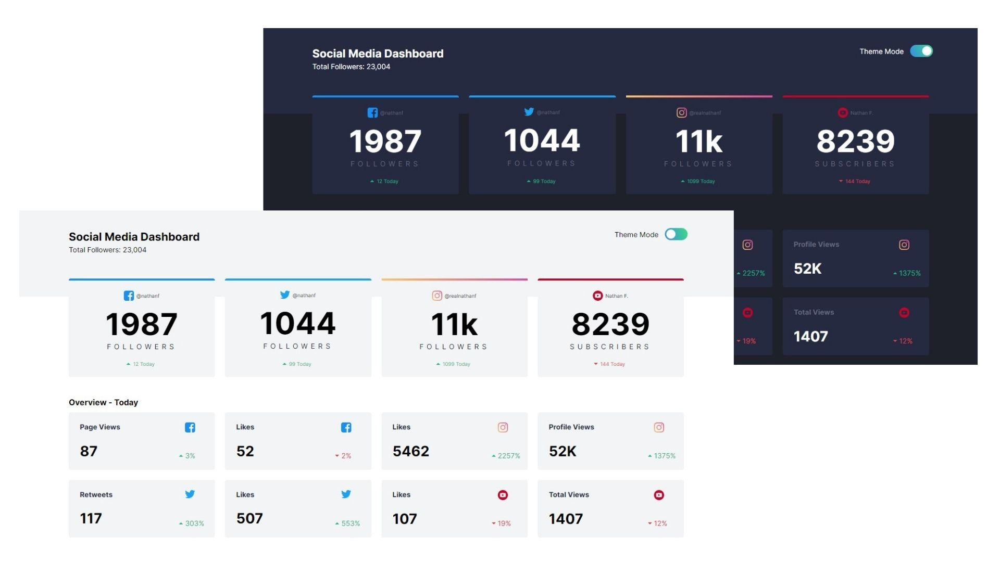

# Frontend Mentor - Social media dashboard with theme switcher solution

This is a solution to the [Social media dashboard with theme switcher challenge on Frontend Mentor](https://www.frontendmentor.io/challenges/social-media-dashboard-with-theme-switcher-6oY8ozp_H).

## Table of contents

- [Overview](#overview)
  - [The challenge](#the-challenge)
  - [Screenshot](#screenshot)
  - [Links](#links)
- [My process](#my-process)
  - [Built with](#built-with)
  - [What I learned](#what-i-learned)
  - [Continued development](#continued-development)
  - [Useful resources](#useful-resources)
- [Author](#author)
- [Acknowledgments](#acknowledgments)

## Overview

### The challenge

- View the optimal layout for the site depending on their device's screen size
- See hover states for all interactive elements on the page
- Toggle color theme to their preference

### Screenshot



### Links

- Solution URL: [Add solution URL here](https://your-solution-url.com)

## My process

### Built with

- StarterKit from Adalab (Bootcamp)
- Semantic HTML5 markup
- Sass (variables, reset and mixins)
- CSS Grid
- Mobile-first workflow
- Javascript

### What I learned

Highlights:

```Sass
Variables
Mixins
Media Queries
```

```js
const change = document.getElementById('check');
change.addEventListener('change', checkingCheckbox, false);
function checkingCheckbox() {
  let checked = change.checked;
  if (checked) {
    document.getElementById('styles').href = './assets/css/mainDark.css';
  } else {
    document.getElementById('styles').href = './assets/css/main.css';
  }
}
};
```

### Continued development

I want to continue working on code optimization and acquire knowledge to add testing to my projects.

### Useful resources

- [CSS-tricks](https://css-tricks.com/snippets/css/complete-guide-grid/) - This helped me to understand grid container/items properties . I really liked this pattern and will use it going forward.

## Author

- Website - [Bertapsan - My github](https://www.your-site.com)
- Linkedin - [Berta Pluma](https://www.linkedin.com/in/bertaplumasanjurjo/)
- Twitter - [@yourusername](https://twitter.com/BertaPSan)
- Frontend Mentor - [@bertapsan](https://www.frontendmentor.io/profile/yourusername)

## Acknowledgments

A special mention to @fmontes for letting me know Frontend Mentor.
